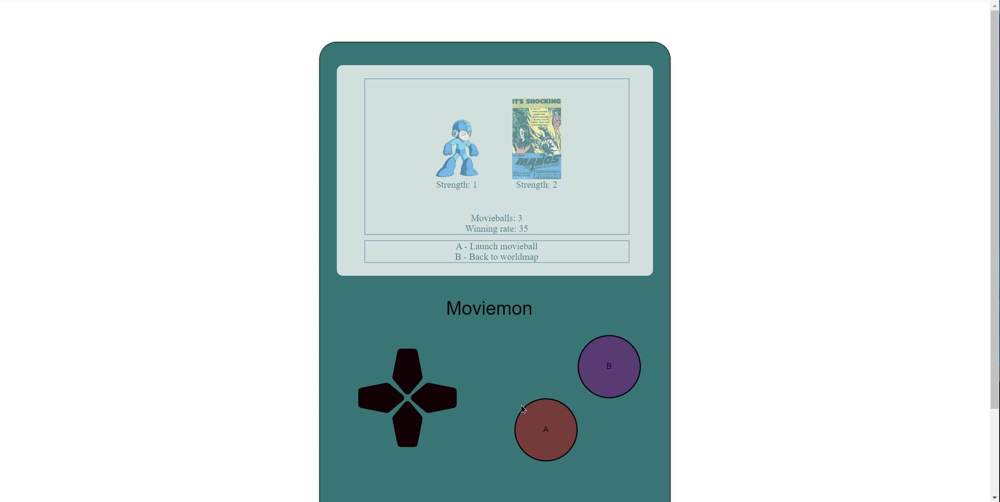
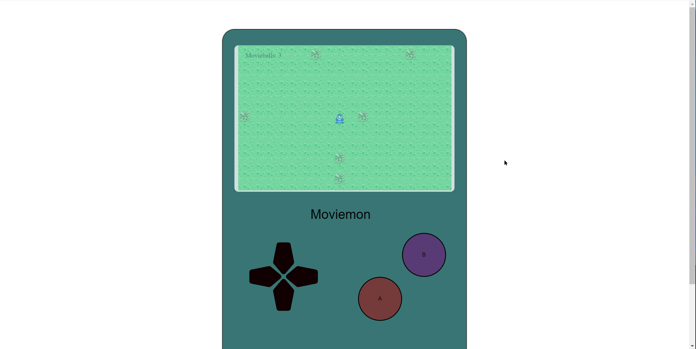
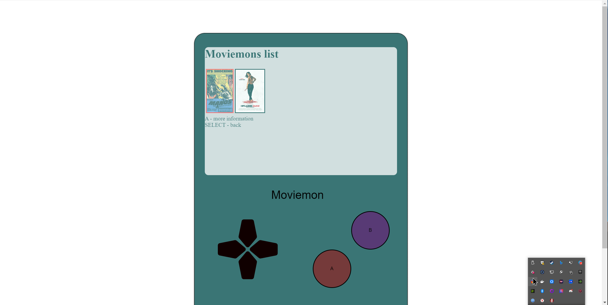
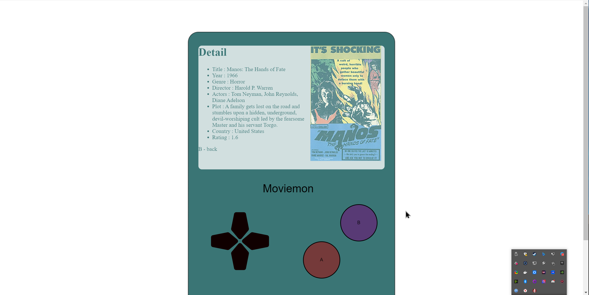
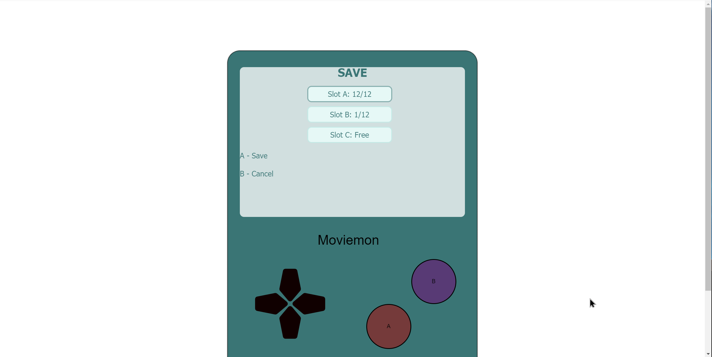

# Django-Bootcamp-Team-Project
Django site with simple game (pockemon like)

You need to catch all Moviemons.
Moviemons info are uploaded from IMDB.

You can fight with moviemon and than catch him:

You cat move on worldmap:

You can see all catched moviemons:

You can save and load game:

